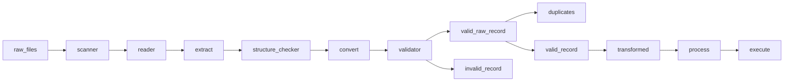

# Pipeline: Port-to-warehouse import exception pipeline.

## Project overview

Entails a supply chain company that imports goods through ports, clears customs, then moves containers to inland warehouses.

Each port sends JSON files with import container events. Some files are clean, some are broken, some have nested records, some have bad dates, some have invalid business values, and some contain duplicate container events.

Your pipeline must scan a folder, extract records from multiple JSON structures, validate and convert fields, handle controlled file failure, separate valid/invalid/duplicate records, transform valid records, summarize business results, and produce a final run summary.

## Process workflow

```Markdown

```
