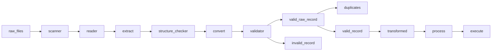

# Pipeline: Port-to-warehouse import exception pipeline.

## Project overview

Entails a supply chain company that imports goods through ports, clears customs, then moves containers to inland warehouses.

Each port sends JSON files with import container events. Some files are clean, some are broken, some have nested records, some have bad dates, some have invalid business values, and some contain duplicate container events.

Your pipeline must scan a folder, extract records from multiple JSON structures, validate and convert fields, handle controlled file failure, separate valid/invalid/duplicate records, transform valid records, summarize business results, and produce a final run summary.

## Process workflow

```Markdown


```
```


## Orchestration Levels

The pipeline has three levels of control:

### Level one: `execute.py`

This is the pipleine entry point. It's responsibility is to:

* start the pipeline
* call `process_all_files()`
* receive the final run results
* print the overall execution report

### Level 2:  `process_all_files()`

This controls the entire batch. Its's responsibility is to:

* scan the input folder
* receive the discovered file_paths
* process each file
* collect each file result
* create run levels totals
* handle folder level failures

This function orchestrates the batch

the expectes output of `process_all_files` is **file_results**

### Level 3:  `process_one_file()`

This controls one file. Its's responsibility is to:

* read one file
* extract records and metadata
* convert values
* validate rows
* create function that is used to get invalid & valid rows
* separate duplicates & valid rows
* transform valid rows
* summarize transformed rows
* write file level outputs

This function orchestrates file level work flow

The expected output from `process_one_file` is **file_result**
